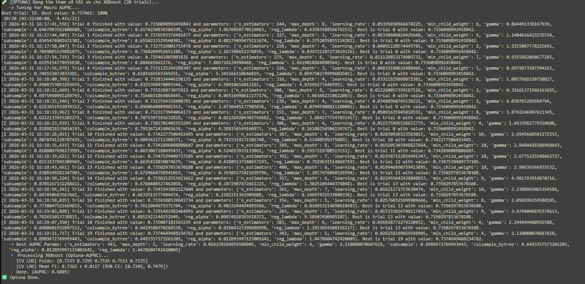
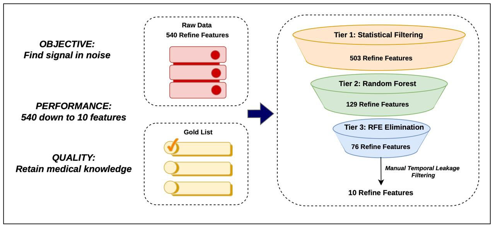
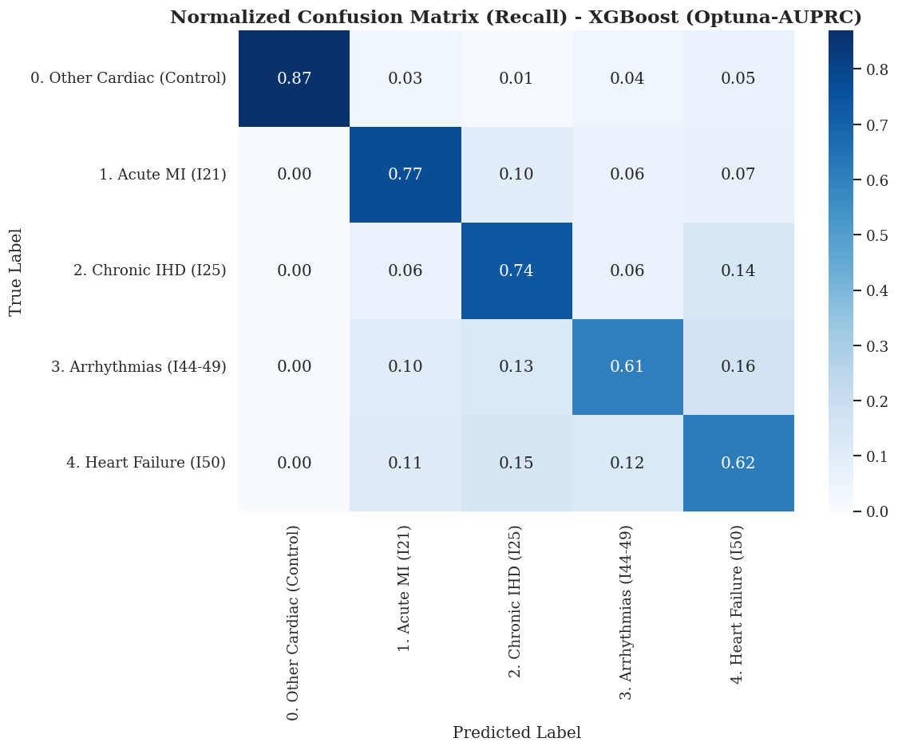
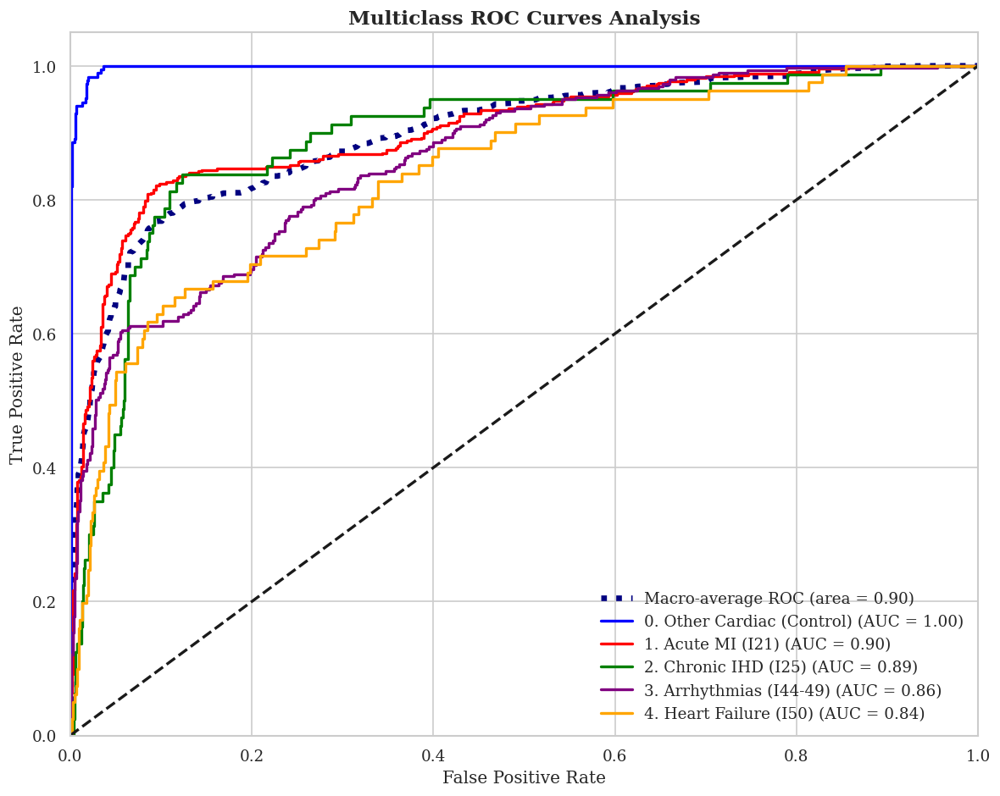
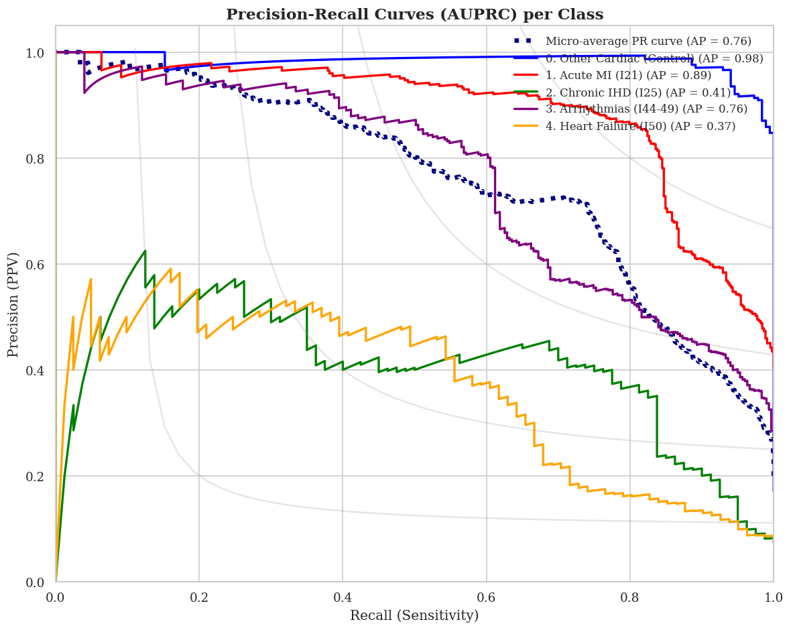
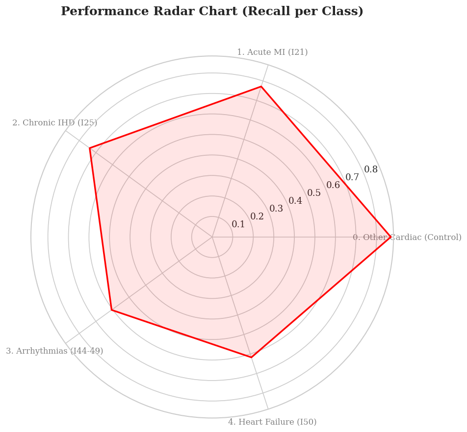
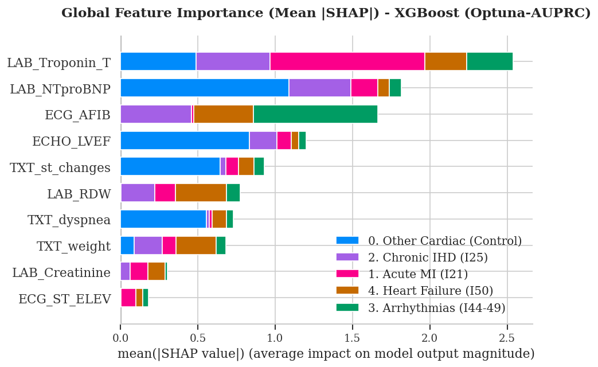
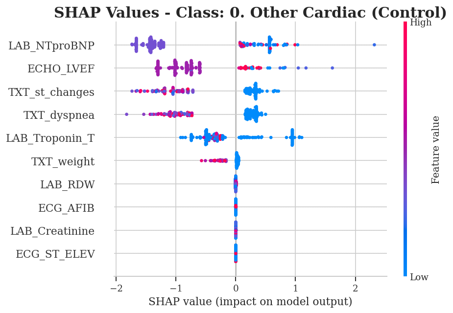
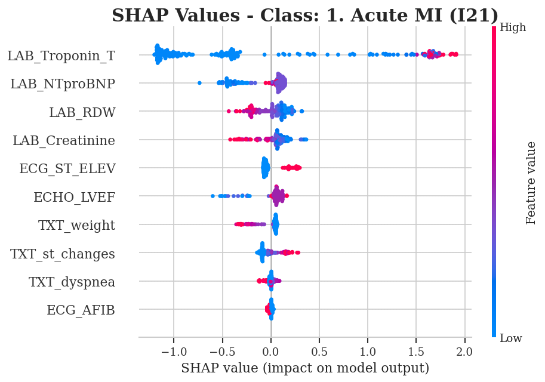

# Experimental Results & Visualizations

This directory contains the comprehensive evaluation results and interpretability plots generated by the Leakage-Aware Machine Learning framework.

## 📋 Summary of Figures

### 1. Framework & Workflow
* **`pipeline_workflow.jpg`**: A high-level overview of the end-to-end architecture.

### 2. Model Optimization & Feature Selection
* **`fig1_optuna_history.png`**: Convergence of hyperparameter optimization.

* **`Feature_Selection_Funnel.png`**: Step-by-step feature reduction.

### 3. Performance Metrics (Multi-Class Evaluation)
* **`confusion_matrix.png`**: Breakdown of true vs. predicted labels.

* **`multi-class_roc.png`** & **`multi-class_precision-recall.png`**:
Standard evaluation curves for EHR data.

* **`performance_radar.png`**: Holistic view of model stability across metrics.

### 4. Model Interpretability (SHAP Analysis)
We use SHAP to ensure clinical transparency:
* **Global Importance (`mean_shap.png`)**:

* **Class-Specific Explanations (`shap_class_0.png` & `shap_class_1.png`)**:

---

## 📈 How to Re-generate
All figures above can be reproduced by executing the notebook located in the `/notebooks` directory. The plots are generated using `matplotlib`, `seaborn`, `Optuna.visualization`, and the `SHAP` library.

## 📄 Usage in Publication
These figures are the high-resolution versions of the images used in the main manuscript and supplementary materials of the study.
